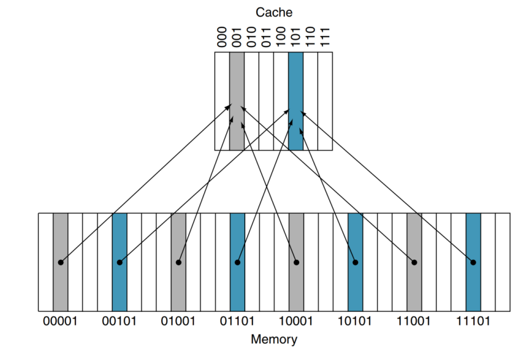

# 캐시 메모리(Cache Memory)

속도가 빠른 장치와 느린 장치에서 속도 차이에 따른 현상을 줄이기 위한 메모리를 말한다.

```txt
1. CPU 코어와 메모리 사이의 병목 현상 완화
2. 웹 브라우저 캐시 파일은, 하드디스크와 웹페이지 사이의 병목 현상을 완화
```

CPU가 주기억장치에서 저장된 데이터를 읽어올 때, 자주 사용하는 데이터를 캐시 메모리에 저장한 뒤, 다음에 이용할 때 주기억장치가 아닌 캐시 메모리에서 먼저 가져오면서 속도를 향상스킨다.

속도라는 장점을 얻지만, 용량이 적기도 하고 비용이 비싼 단점이 있습니다.

CPU에는 이러한 캐시 메모리가 2 ~ 3 개 정도 사용됩니다. (L1, L2, L3 캐시 메모리라고 부른다.)

속도와 크기에 따라 분류한 것으로, 일반적으로 L1 캐시부터 먼저 사용이 됩니다.(CPU에서 가장 빠르게 접근하고, 여기서 데이터를 찾지 못하면 L2로 이동)

## 듀얼 코어 프로세서의 캐시 메모리

각 코어마다 독립된 L1 캐시 메모리를 가지고, 두 코어가 공유하는 L2 캐시 메모리가 내장되어 있습니다.

만약 L1 캐시가 128kb라면 64/64로 나누어 64kb에 명령어를 처리하기 직전의 명령어를 임시 저장하고, 나머지 64kb에는 실행 후 명렁어를 임시 저장합니다.

- L1 : CPU 내부에 존재
- L2 : CPU 와 RAM 사이에 존재
- L3 : 보통 메인보드에 존재

> 캐시 메모리 크기가 작은 이유 : SRAM 가격이 비싸다

## 디스크 캐시

주 기억장치(RAM) 와 보조기억장치(하드디스크) 사이에 존재하는 캐시

## 캐시 메모리 작동 원리

- 시작 지역성

  - for 나 while 같은 반복문에 사용하는 조건 변수처럼 한번 참조된 데이터는 잠시 후 또 참조될 가능성이 높다.

- 공간 지역성
  - A[0] , A[1]과 같은 연속 접근 시, 참조된 데이터 근처에 있는 데이터가 잠시후 또 사용될 가능성이 높다.
    > 이처럼 촘조 지역성의 원리가 존재

캐시에 데이터를 저장할 때는, 이러한 참조 지역성(공간)을 최대한 활용하기 위해 해당 데이터뿐만 아니라, 옆 주소의 데이터도 같이 가져와 미래에 쓰일 것을 대비한다.

CPU가 요청한 데이터가 캐시에 있으면 'Cahce Hit', 없어서 DRAM에서 가져오면 'Cache Miss'

## 캐시 미스의 3가지 경우

- Cold miss : 해당 메모리 주소를 처음 불러서 나는 미스

- Conflict miss : 캐시 메모리에 A와 B 데이터를 저장해야 하는데, A와 B가 같ㅇ는 캐시 메모리 주소에 할당되어 있어서 나는 미스(direct mapped cache에서 많이 발생)

```txt
예시 : 핸드폰과 열쇠를 가방에 넣고 다니는데, 잠깐 물건을 받느라 손에 들고 있던 핸드폰을 주머니에 넣음. 그 이후 핸드폰을 찾기 위해 가방을 뒤졌는데 가방에 없는 상황
```

- Capacity miss : 캐시 메모리의 공간이 부족해서 나는 미스 (Conflict는 주소 할당 문제, Capacity는 공간 문제)

캐시 크기를 키워서 문제를 해결하려면 캐시 접근속도가 느려지고 파워를 많이 먹는 단점

## 구조 및 작동 방식

- 직접 사상 캐시 (Direct Mapped Cache) : 각 메모리의 위치가 캐시 내에서 정확히 한 곳에만 매핑되는 구조

가장 기본적인 구조로 DRAM의 여러 주소가 캐시 메모리에 한 주소에 대응하는 다대일 방식

Cache의 block size는 8 이므로 Memory를 8개로 나누어서 각각 mapping 합니다.

간단하고 빠른 장점이 있지만 Conflict Miss가 발생하는 것이 단점입니다.


- 완전 연관 캐시 메모리 (Fully Associative Cache) : Direct Mapped Cache 정반대로 동작한다.

비어있는 캐시 메모리가 있으면 , 마음대로 주소를 저장하는 방식

저장할 때는 매우 간단하지만 , 찾을 때가 문제

조건이나 규칙이 없어서 특정 캐시 Set 안에 있는 모든 블럭을 한번에 찾아 원하는 데이터가 있는지 검색해야 한다.
CAM 이라는 특수한 메모리 구조를 사용해야하지만 가격이 매우 비싸다.

- Set Associative Cache

Direct + Fully 방식이다. 특정 행을 지정하고, 그 행안의 어떤 열이든 비어있을 때 저장하는 방식이다. Direct에 비해 검색 속도는 느리지만, 저장이 빠르고 Fully에 비해 저장이 느린 대신 검색이 빠른 중간형이다.

> 실제와 위 두가지보다 나중에 나온 방식
